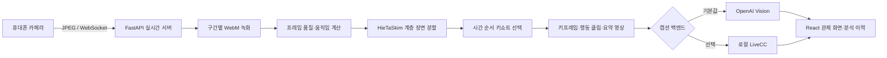
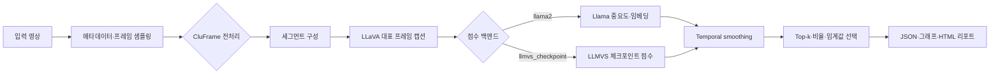

# CluLLM

CluLLM은 휴대폰 카메라 영상을 실시간으로 수집하고, 시간 순서를 유지한 핵심 장면과 요약 영상을 생성하는 영상 관제·요약 시스템입니다.

현재 프로젝트는 다음 두 실행 경로를 제공합니다.

- **실시간 관제 파이프라인**: 휴대폰 카메라 최대 4대를 연결해 주기별로 녹화 영상을 분석하고, HieTaSkim 기반 키쇼트·요약 영상·행동 설명을 생성합니다.
- **파일 분석 파이프라인**: 업로드한 영상 또는 감시 폴더의 영상을 K-Means, 변화량, LLaVA/Llama, LLMVS 체크포인트, CluFrame 방식으로 분석합니다.

## 주요 기능

- QR 코드로 휴대폰 카메라 연결
- 최대 4개 카메라 동시 관제
- 30초, 1분, 5분, 10분, 30분, 1시간 단위 분석
- 실시간 영상 저장과 수동 즉시 분석
- HieTaSkim 기반 시간 순서 보존 키쇼트 생성
- 대표 키프레임, 행동 클립, 요약 영상 생성
- OpenAI Vision 또는 로컬 LiveCC 기반 장면 설명
- 과거 분석 조회 및 선택 삭제
- 업로드 영상 테스트
- 기존 LLaVA/Llama 기반 LLMVS 파일 분석

## 현재 실시간 파이프라인



처리 순서는 다음과 같습니다.

1. 휴대폰 브라우저가 후면 카메라 프레임을 WebSocket으로 전송합니다.
2. 서버는 수신 화면을 관제 화면에 전달하고, 분석용 영상은 기본 4 FPS로 구간별 저장합니다.
3. 각 구간에서 프레임 품질, 움직임, 카메라 전체 이동 여부와 시각 특징을 계산합니다.
4. HieTaSkim으로 시간 계층을 구성하고 장면 상태가 바뀌는 연속 구간을 찾습니다.
5. 시간 순서를 유지한 키쇼트를 선택해 대표 이미지, 행동 클립과 요약 영상을 만듭니다.
6. OpenAI Vision 또는 LiveCC가 선택 장면을 설명하고, 전체 구간 요약을 생성합니다.
7. 결과를 React 관제 화면에 표시하고 `outputs/` 아래에 JSON과 미디어 파일로 저장합니다.

## 기술 구성

| 영역 | 구성 |
| --- | --- |
| 관제 화면 | React 19, Vite |
| 실시간 API | FastAPI, WebSocket, Uvicorn |
| 영상 처리 | OpenCV, NumPy, PyAV |
| 계층 요약 | HieTaSkim, Higra, TensorFlow ResNet50 특징 |
| 장면 설명 | OpenAI Vision 또는 LiveCC 로컬 모델 |
| 기존 파일 분석 | Streamlit, LLaVA, Llama 2, LLMVS, CluFrame |
| 저장 형식 | WebM, JPEG, JSON, HTML, ZIP |

## 프로젝트 구조

```text
.
|-- realtime_frontend/       # React 관제·휴대폰 화면
|-- realtime_server.py       # FastAPI REST/WebSocket 서버
|-- realtime_analysis.py     # 녹화, HieTaSkim, 키쇼트·요약 생성
|-- run_realtime_app.py      # HTTPS 실시간 앱 실행기
|-- upload_test.py           # 업로드 영상 분석 API
|-- livecc_caption.py        # LiveCC 샘플링·추론
|-- livecc_jobs.py           # LiveCC 비동기 작업 큐
|-- web_app.py               # 기존 Streamlit 파일 분석 UI
|-- pipeline.py              # LLaVA/Llama 기반 파일 분석 파이프라인
|-- modules/                 # 샘플링, 전처리, 점수화, 결과 저장 모듈
|-- networks/                # LLMVS 체크포인트 네트워크
|-- tests/                   # Python 테스트
|-- outputs/                 # 실행 결과; Git 제외
|-- web_uploads/             # 업로드 원본; Git 제외
|-- watch_videos/            # 폴더 감시 입력; Git 제외
`-- config.yaml              # 파일 분석 기본 설정
```

## 요구 사항

- Windows 10/11
- Python 3.11 권장
- Node.js 20 이상
- 휴대폰과 PC가 연결된 동일한 Wi-Fi 네트워크
- AI 캡션 사용 시 OpenAI API 키 또는 LiveCC 로컬 모델
- LLaVA/Llama/LiveCC 로컬 추론 시 CUDA GPU 권장

## 1. 실시간 관제 앱 설치

### Python 환경

```powershell
py -3.11 -m venv .venv-realtime
.\.venv-realtime\Scripts\Activate.ps1
python -m pip install --upgrade pip setuptools wheel
python -m pip install "fastapi>=0.135,<1" -r requirements-realtime.txt
```

LiveCC 클립 디코딩까지 사용할 때는 다음 의존성을 추가합니다.

```powershell
python -m pip install -r requirements-livecc-sampling.txt
```

### React 프런트엔드

```powershell
npm.cmd --prefix realtime_frontend install
npm.cmd --prefix realtime_frontend run build
```

## 2. 캡션 백엔드 설정

프로젝트 루트에 `.env` 파일을 만듭니다. `.env`는 Git에 커밋되지 않습니다.

### OpenAI Vision 사용

```dotenv
CAPTION_BACKEND=openai
REALTIME_AI_ENABLED=true
OPENAI_API_KEY=your_api_key
OPENAI_VISION_MODEL=gpt-4o-mini
```

API 없이 영상 요약 로직만 확인하려면 다음처럼 설정합니다.

```dotenv
CAPTION_BACKEND=openai
REALTIME_AI_ENABLED=false
```

이 경우 키프레임, 클립과 요약 영상은 생성되지만 AI 행동 설명은 제한됩니다.

### LiveCC 로컬 모델 사용

```dotenv
CAPTION_BACKEND=livecc
REALTIME_AI_ENABLED=true
LIVECC_MODEL_PATH=.livecc/model/<revision>
```

LiveCC는 별도 가상환경과 고정 리비전 모델이 필요합니다. 설치와 검증 절차는 [LIVECC_SETUP.md](LIVECC_SETUP.md)를 참고하세요.

## 3. 실시간 관제 앱 실행

### 휴대폰 연결용 HTTPS 실행

```powershell
.\.venv-realtime\Scripts\python.exe run_realtime_app.py
```

실행 후 터미널에 다음 주소가 표시됩니다.

- **관제 화면**: PC 브라우저에서 여는 관리자 주소
- **휴대폰 최초 설정**: 로컬 HTTPS 인증서를 설치하기 위한 주소

휴대폰에서 카메라 권한을 사용하려면 HTTPS가 필요합니다. 최초 한 번 인증서를 등록한 뒤 관제 화면의 QR 코드를 스캔하세요. 세부 절차는 [REALTIME_GUIDE.md](REALTIME_GUIDE.md)를 참고하세요.

### PC에서만 개발 모드 실행

```powershell
.\.venv-realtime\Scripts\python.exe run_realtime_app.py --dev-http
```

`--dev-http`는 `127.0.0.1`에만 바인딩되며 휴대폰 카메라 연결용이 아닙니다.

### 주요 실행 옵션

```text
--port 8765              서버 포트
--lan-ip 192.168.x.x     휴대폰에 표시할 PC의 LAN 주소
--public-origin URL      외부 HTTPS 주소
--cert PATH --key PATH   직접 준비한 TLS 인증서와 개인 키
--dev-http               PC 로컬 개발용 HTTP
```

## 실시간 결과 구조

세션별 결과는 다음 위치에 저장됩니다.

```text
outputs/phone_YYYYMMDD_HHMMSS_<session>/
|-- recordings/                 # 분석 주기별 원본 녹화 구간
|-- analysis/
|   |-- keyframes/              # 대표 키프레임
|   |-- clips/                  # 선택 장면 클립
|   `-- summary_videos/         # 시간 순서 요약 영상
|-- history/                    # 분석 배치별 이력
|-- metadata.json
|-- summary.json
|-- batches.json
`-- analysis.json
```

영상, 녹화 결과, 모델 체크포인트와 API 키는 `.gitignore`로 제외되며 소스 저장소에 업로드되지 않습니다.

## 기존 영상 파일 분석

Streamlit UI에서는 다음 다섯 가지 방식을 제공합니다.

| 방식 | 설명 |
| --- | --- |
| K-Means 클러스터링 | 시각 특징을 군집화해 대표 프레임 선택 |
| 빠른 변화량 분석 | 프레임 변화량 기반의 경량 키프레임 추출 |
| LLaVA / Llama 분석 | LLaVA 캡션과 Llama 중요도 점수 사용 |
| LLMVS 체크포인트 분석 | Llama 임베딩을 LLMVS 체크포인트로 점수화 |
| CluFrame + LLMVS 분석 | 중복 후보 제거 후 LLaVA/Llama 분석 |

### 설치

```powershell
py -3.11 -m venv .venv
.\.venv\Scripts\Activate.ps1
python -m pip install --upgrade pip setuptools wheel
python -m pip install torch torchvision torchaudio --index-url https://download.pytorch.org/whl/cu121
python -m pip install -r requirements.txt
```

### Streamlit UI 실행

```powershell
python run_web_app.py
```

브라우저에서 영상을 업로드하거나 `watch_videos/` 폴더를 감시할 수 있습니다.

### CLI 실행

`config.yaml`의 `input.video_path`와 분석 설정을 수정한 뒤 실행합니다.

```powershell
python main.py --config config.yaml
```

### 파일 분석 파이프라인



기본 설정은 `config.yaml`에서 관리합니다.

```yaml
sampling:
  fps: 10

preprocessing:
  enabled: false
  max_candidates: 30
  feature_backend: lightweight

segment:
  segment_sec: 5.0

scoring:
  backend: llama2
  use_quantization_4bit: true

global_context:
  mode: temporal_smoothing
  smoothing_window: 3

selection:
  mode: top_k
  top_k: 10
```

파일 분석 결과는 `outputs/<run_name>/` 아래에 `metadata.json`, `frames.json`, `segments.json`, `scores.json`, `summary.json`, 선택 프레임, 점수 그래프와 HTML 리포트로 저장됩니다.

## 테스트

### Python

```powershell
.\.venv-realtime\Scripts\python.exe -m unittest discover -s tests -v
```

LiveCC 관련 테스트에는 `requirements-livecc-sampling.txt`의 PyAV가 필요합니다.

### React 빌드

```powershell
npm.cmd --prefix realtime_frontend run build
```

### 브라우저 E2E 테스트

```powershell
npm.cmd --prefix realtime_frontend run test:ui
```

## 보안 및 저장 정책

- `.env`와 API 키는 커밋하지 않습니다.
- 휴대폰 연결 토큰과 관리자 토큰은 실행 시 무작위로 생성됩니다.
- 음성은 전송하지 않으며 영상과 분석 결과는 관제 PC에 저장됩니다.
- `outputs/`, `web_uploads/`, `watch_videos/`, 모델 캐시와 체크포인트는 Git에서 제외됩니다.
- 생성된 로컬 CA 인증서는 이 프로젝트의 휴대폰 연결에만 사용하고, 사용 종료 후 기기에서 제거할 수 있습니다.

## 관련 문서

- [REALTIME_GUIDE.md](REALTIME_GUIDE.md): 휴대폰 연결과 실시간 관제 사용법
- [LIVECC_SETUP.md](LIVECC_SETUP.md): LiveCC 고정 리비전 설치·검증
- [PIPELINE_SUMMARY.md](PIPELINE_SUMMARY.md): 기존 파일 분석 파이프라인 요약
- [02_방법론_설계서_RTX3060.md](02_방법론_설계서_RTX3060.md): RTX 3060 기준 모델 실행 설계
- [MULTI_MOBILE_STREAM_DESIGN.md](MULTI_MOBILE_STREAM_DESIGN.md): 다중 휴대폰 스트림 설계

## 알려진 제약

- 모바일 카메라 연결은 신뢰 가능한 HTTPS 환경이 필요합니다.
- 로컬 LLaVA/Llama/LiveCC 추론은 모델 다운로드 공간과 GPU 메모리를 많이 사용합니다.
- LLMVS 체크포인트와 모델 가중치는 저장소에 포함되지 않으므로 별도로 준비해야 합니다.
- AI 캡션이 비활성화되거나 실패해도 키프레임과 요약 영상 생성은 계속 진행됩니다.
